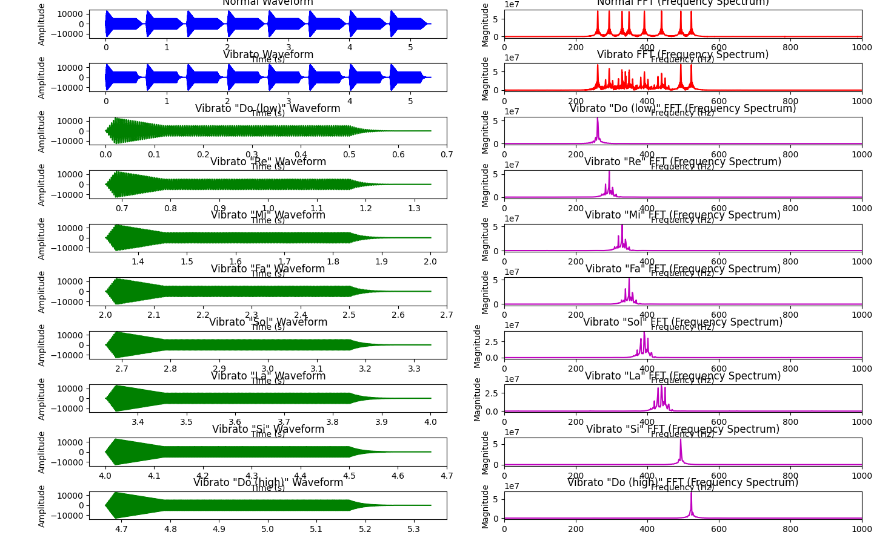

PAV - P5: síntesis musical polifónica
=====================================

Obtenga su copia del repositorio de la práctica accediendo a [Práctica 5](https://github.com/albino-pav/P5) 
y pulsando sobre el botón `Fork` situado en la esquina superior derecha. A continuación, siga las
instrucciones de la [Práctica 2](https://github.com/albino-pav/P2) para crear una rama con el apellido de
los integrantes del grupo de prácticas, dar de alta al resto de integrantes como colaboradores del proyecto
y crear la copias locales del repositorio.

Como entrega deberá realizar un *pull request* con el contenido de su copia del repositorio. Recuerde que
los ficheros entregados deberán estar en condiciones de ser ejecutados con sólo ejecutar:

~~~~~~~~~~~~~~~~~~~~~~~~~~~~~~~~~~~~~~~~~~~~~~~~~~~~~.sh
  make release
~~~~~~~~~~~~~~~~~~~~~~~~~~~~~~~~~~~~~~~~~~~~~~~~~~~~~

A modo de memoria de la práctica, complete, en este mismo documento y usando el formato *markdown*, los
ejercicios indicados.

## Ejercicios.


*mencionar que todos nuestros comentarios son escritos en cursivo*

### Envolvente ADSR.

Tomando como modelo un instrumento sencillo (puede usar el InstrumentDumb), genere cuatro instrumentos que
permitan visualizar el funcionamiento de la curva ADSR.

* Un instrumento con una envolvente ADSR genérica, para el que se aprecie con claridad cada uno de sus
  parámetros: ataque (A), caída (D), mantenimiento (S) y liberación (R).

  - *Podemos observar una ADSR genérica, con un ataque del 10% de duración, una caída del 20%, un mantenimiento del 50% y una liberación final del 20%.* 

  
  
  - A continuación, se muestra un ejemplo específico utilizando el instrumento `seno` y la primera nota "do" del archivo `doremi.sco`. El archivo de audio resultante se llama `seno.wav`. El comando utilizado para generar el archivo de audio es:

    ```sh
    synth seno.orc doremi.sco seno.wav
    ```

    La gráfica a continuación ilustra las fases de Ataque (A), Decaimiento (D), Mantenimiento (S) y Liberación (R) de la señal de audio generada:

    

    En esta gráfica, podemos observar claramente cómo la envolvente ADSR se aplica a una nota específica del instrumento `seno`.

* Un instrumento *percusivo*, como una guitarra o un piano, en el que el sonido tenga un ataque rápido, no
  haya mantenimiemto y el sonido se apague lentamente.
  - Para un instrumento de este tipo, tenemos dos situaciones posibles:
    * El intérprete mantiene la nota *pulsada* hasta su completa extinción.

      - *podemos observar como no hay existencia (almenos apreciable) de la región de mantenimiento, y la caída hacia 0 del instrumento se compone de una decaída progresiva y gradual.*

      

    * El intérprete da por finalizada la nota antes de su completa extinción, iniciándose una disminución
	  abrupta del sonido hasta su finalización.

      - *ahora el tramo de liberación debe suponer una mayor extensión, debido a que, como dice el enunciado, el intérprete ha dado por finalizada la nota "antes de tiempo".*

      

  - Debera representar en esta memoria **ambos** posibles finales de la nota.
* Un instrumento *plano*, como los de cuerdas frotadas (violines y semejantes) o algunos de viento. En
  ellos, el ataque es relativamente rápido hasta alcanzar el nivel de mantenimiento (sin sobrecarga), y la
  liberación también es bastante rápida.

  - *podemos ver como el ADSR descrito abajo cumple con las condiciones de dicho tipo de instrumento:*

  

Para los cuatro casos, deberá incluir una gráfica en la que se visualice claramente la curva ADSR. Deberá
añadir la información necesaria para su correcta interpretación, aunque esa información puede reducirse a
colocar etiquetas y títulos adecuados en la propia gráfica (se valorará positivamente esta alternativa).

### Instrumentos Dumb y Seno.

Implemente el instrumento `Seno` tomando como modelo el `InstrumentDumb`. La señal **deberá** formarse
mediante búsqueda de los valores en una tabla.

- Incluya, a continuación, el código del fichero `seno.cpp` con los métodos de la clase Seno.

**(añadir el código cuando esté finalizado)**
```cpp

```
- Explique qué método se ha seguido para asignar un valor a la señal a partir de los contenidos en la tabla, e incluya una gráfica en la que se vean claramente (use pelotitas en lugar de líneas) los valores de la tabla y los de la señal generada.

  *Como se ve en el for() del constructor de la clase **InstrumentSeno**, la tabla se construye en base a un periodo entero de una señal senoidal como cualquier otra, en incrementos que van en función del número de muestras que deseamos tener dentro de la tabla, es decir, como más puntos almacenemos, más pequeños serán los incrementos y por lo tanto tendremos el equivalente de un periodo de senoide almacenado en la tabla muestreado con frecuencia de muestreo más alta.*

  *Cuando los valores estén ya dentro de la tabla, la recorremos con una velocidad determinada, cosa que viene dada por la frecuencia fundamental del propia instrumento seno mediante la conversión de nota a f0:*

  ```cpp
  f0 = 440.0f * pow(2.0f, (note - 69.0f) / 12.0f);
  ```

  *El recorrido de la tabla se realiza posterior a una llamada al método **command()**, donde en caso de iniciarse una nota, declaramos la variable que nos indica la velocidad a la cual recorrer la tabla, cuya línia de código se explicita a continuación:*

  ```cpp
  increment = ((f0 / SamplingRate) * tbl.size());
  ```

  *Gracias a esta variable, cuando llamemos al método **synthesize()**, podremos recorrer la tabla a la velocidad deseada. Por ejemplo, si nuestra tabla almacena 40 valores (valor default de N (tamaño de `tbl`)) para recorrer la tabla a velocidad de muestra a muestra (sin saltarnos ninguna, que en teoría podría entenderse como la velocidad más baja, aunque también sería posible ir 1/2 o 1/4 o menos de muestras/tick) nuestra frecuencia fundamental `f0` debe ser un 1/40 de la frecuencia de muestreo (declarada como `SamplingRate` en el código) que equivale a 44100 Hz.*

  *En este caso, el señal base reproducido por el instrumento Seno sería idéntico al señal almacenado en `tbl[n]`. A continuación graficamos en rojo el señal `tbl[n]` junto con la reproducción del instrumento Seno cuando se cumplen dichas condiciones de `f0`. Se ha sumado 1 al señal `x[n]` para que pudiera distinguirse del señal base `tbl[n]`:*

  ![visualización señal base tbl[n] con x[n] cuando f0 = Fs/40](img/SR:40_noInterpolation.png)

  *De hecho esta perfecta alineación entre los señales se producirá siempre que `f0` sea la N-ésima parte de la frecuencia de muestreo `SamplingRate`, donde N es el tamaño de la tabla.*

  *Si quisiéramos recorrer la tabla a mayor velocidad y por lo tanto saltarnos muestras, como por ejemplo, ir de 2 en 2 muestras (el doble del caso anterior), debemos fijar `f0` al doble, por lo tanto a un 1/20 del `SamplingRate`. En este caso, el señal obtenido en base a la tabla `tbl` se construiria de la siguiente forma (si x[n] es el señal del instrumento y tbl[n] es la tabla donde se contienen los valores por defecto):*

  *x[0] = tbl[1], x[1] = tbl[3], x[2] = tbl[5] ...*

  *A continuación mostramos un gráfico donde se puede visualizar de forma semejante al anterior gráfica, la diferencia entre las 2 señales, donde a `x[n]` se le ha sumado 1 para que pueda diferenciarse mejor de la otra señal. Hemos de tener en cuenta que aunque parezca que ambas señales estén durando lo mismo, cuando se vaya a realizar la orquestración, la reproducción de un instrumento se realiza a base de ticks/segundo y como `x[n]` ahora tiene menos puntos por periodo que la `x[n]` del apartado anterior (la mitad exactamente), ésta se reproduciría el doble de rápido y así es como aconseguiríamos la percepción de una `f0` distinta:*

  

*Hasta ahora la recogida de valores desde `tbl[n]` se ha heco de forma exacta, es decir, no hay ambiguedad sobre que valores de la tabla escoger, ya que los incrementos eran enteros (en el primer caso de f0 = SamplingRate/40, el incremento era de 1 en 1 mientras que en el segundo caso el incremento era el doble, 2). También nos gustaría enseñar lo que sucedería cuando dichos incrementos no son tan perfectos, y nos encontramos en la situación de tener que coger valores de la tabla intermedios, por ejemplo, si incremento = 1.5, los valores a los que accederíamos en `tbl[n]` serian `tbl[0], tbl[1.5], tbl[3], tbl[4.5]...`. Se han implementado 2 soluciones para redimirlo:*

* *Aproximación del índice decimal al entero más próximo e.g. 4.5 -> 5 o 3.4 = 3. Llamámosle el caso **1**.*

* *Interpolación Ponderada (Weighed Interpolation) e.g. si el índice = 4.7, interpolamos entre las muestras del índice 4 y 5 pero tal que 70% de la contribución proviene del índice 5 y el 30% de la contribución proviene de índice 4. Llamámosle el caso **2**.*

*En cuanto el **caso 1**, este procedimiento se realiza con la ejecución de:*

```cpp
x[i] = A * tbl[round(phas)];
```
*Este método de resolución de índices puede ser problemática cuando se desee reproducir un señal con alta fidelidad y reducir las distorsiones incorporadas por dicha aproximación. Ocurrirá distorsión siempre que la `f0` que se esté emulando no sea un múltiplo exacto de 44100/N donde N es el tamaño de `tbl[n]`. En nuestro caso, N=40 y por lo tanto cualquier nota músical cuya equivalente `f0` no sea un múltiplo entero de 1102,5 Hz tendrá distorsión. Veamos un ejemplo donde usamos 2 notas músicales relativamente próximas en cuanto a la `f0` y observemos como realmente hay presencia de distorsión.*

*Vamos a visualizar las "diferentes" formas de onda producidas por el instrumento Seno cuando queremos emular la nota `69` (`f0 = 440 Hz`) y luego la nota `73` (`f0 = 554 Hz`):*

*Antes dijimos que para que el Seno cogiese todos los valores de la tabla (N=40), la `f0` de su nota tenia que ser 44100/40 = 1102.5 Hz. La nota 69 tiene un `f0` de 440 Hz, por lo tanto deberemos recorrer `tbl[n]` a mucha menor velocidad y tendremos que "inventarnos" valores en medio de otros dentro de la tabla. Aproximadamente, tendremos que "inventarnos" unos 2-3 muestras entre índices de la tabla sucesivos (1/40 / 440/44100). Si graficamos junto este señal otro con una `f0` parecida pero algo distinta, como por ejemplo la nota 73 cuyo `f0` equivale a unos 554 Hz, recorreremos la tabla un poco más rápida pero, lo importante de entender de este análisis, es el hecho que este método de aproximación del índice supone distorsión aparente ya que muestras sucesivas deben repetirse entre sí (básicamente cuando se usan frecuencias por debajo de los comentados 1102,5 Hz). Esto no es un efecto que se produce cuando se usan frecuencias fundamentales superiores a dicho valor, aunque siempre que no implementemos un método de interpolación inteligente, siempre estaremos limitados a los valores proporcionados por la tabla inicial. Más de esto después de la gráfica:*

![gráfica de tbl[n] vs 2 señales de 2 notas distintas, sin interpolación](img/Note69vs73.png)
*Notar que x[n] es la senoide de la nota 69 mientras que y[n] es de la nota 73.*


- Si ha implementado la síntesis por tabla almacenada en fichero externo, incluya a continuación el código
  del método `command()`.

```cpp
void InstrumentSeno::command(long cmd, long note, long vel) {
    f0 = 440.0f * pow(2.0f, (note - 69.0f) / 12.0f); // Conversión de nota a frecuencia

    if (cmd == 9) { // 'Key' pressed: attack begins
        bActive = true;
        adsr.start();
        index = 0;
        phas = 0.0f;
        increment = ((f0 / SamplingRate) * tbl.size());
        A = vel / 127.0f;
        
        // Cargar la tabla desde un fichero externo
        std::ifstream file("sine_table.dat");
        if (file.is_open()) {
            for (int i = 0; i < tbl.size(); ++i) {
                file >> tbl[i];
            }
            file.close();
        } else {
            std::cerr << "Error: no se pudo abrir el archivo sine_table.dat" << std::endl;
        }
    } else if (cmd == 8) { // 'Key' released: sustain ends, release begins
        adsr.stop();
    } else if (cmd == 0) { // Sound extinguished without waiting for release to end
        adsr.end();
    }
}
```  

### Efectos sonoros.

- Incluya dos gráficas en las que se vean, claramente, el efecto del trémolo y el vibrato sobre una señal sinusoidal. Deberá explicar detalladamente cómo se manifiestan los parámetros del efecto (frecuencia e índice de modulación) en la señal generada (se valorará que la explicación esté contenida en las propias gráficas, sin necesidad de *literatura*).

## *Trémolo*

*Para la demostración del efecto del trémolo vamos a hacer una comparativa entre la aplicación de dicho efecto con unos parámetros más "normales" o cómodos (A=0.15 y fm=10Hz) y otra con parámetros más "agresivos" (A=1.5 y fm=10Hz). A continuacíon enseñamos el proceso de obtención de una nota bajo el efecto del trémolo y su clara apariencia en la representación gráifca del señal. Empezemos por el trémolo con parámetros "normales":*

*Primero se partió de los siguientes ficheros para generar el `.wav` de donde extraeríamos la señal a analizar:*

***doremi.sco***

```shell
#Time; On (8)/Off (9); Channel; Note; Velocity;
#Time; Control; Channel; Effect; On/Off;
0	9	1	60	100
120	8	1	60	100
0   12  1   13  1 #trémolo inicio
40	9	1	62	100
120	8	1	62	100
40	9	1	64	100
120	8	1	64	100
40	9	1	65	100
120	8	1	65	100
40	9	1	67	100
120	8	1	67	100
40	9	1	69	100
120	8	1	69	100
40	9	1	71	100
0   12  1   13  0 #trémolo final
120	8	1	71	100
40	9	1	72	100
120	8	1	72	100
40	0	1	0	0
```

***effects.orc***

```shell
13	Tremolo	fm=10; A=0.15;
```

***seno.orc***

```shell
1	InstrumentSeno	ADSR_A=0.02; ADSR_D=0.1; ADSR_S=0.4; ADSR_R=0.1; N=40; I=false; percussive=false; 
```

*Luego ejecutamos el programa `synth` de la siguiente manera (ubicandonos dentro de `work/`) que dió lugar al fichero de sonido `seno_tremolo_norma.wav` (todos los ficheros de sonidos realizados a lo largo de la práctica estan presentes en el mismo directorio de `work/` por si al lector le apetece):*

```shell
synth -e effects.orc seno.orc doremi.sco seno_tremolo_normal.wav
```

*A partir de este fichero de audio, podemos extraer la siguientes gráficas del señal contenido en él:*

*Gráfica del do-re-mi con el efecto trémolo (normal) aplicado sobre él:*


*Imagen generada a partir del código Python en `scripts/tremolo.py`*

*Gráfica de la nota Re ampliada destacando zona de aplicación de un período de Trémolo:*


*Imagen generada a partir del código Python en `scripts/tremolo3.py`*

*El fichero de audio de salida (`.wav`) del do-re-mi con éste trémolo de baja potencia aplicado se halla, como todos los ficheros de audio, en el directorio `work/` y se llama **seno_tremolo_normala.wav**.*

*Ahora pasamos a aplicar un efecto del tremolo aún más fuerte. Para cambiar las propidades del efecto, basta con modificar el fichero `work/effects.orc`, que ahora cogerá la siguiente forma:*

```shell
13  Tremolo	fm=10; A=1.5;
```

*Es decir, aumentamos la amplitud de modulación a un 150%, cosa que debería reflejarse como una variación mucha más brusca de la amplitud de las notas de la orquestración. Vamos a verlo ejecutando el comando `synth` enseñado anteriormente con exactamente la misma estructura, solo que ahora cambiamos el fichero de audio de salida por uno llamado `seno_tremolo_agresivo.wav`.*

```shell
synth -e effects.orc seno.orc doremi.sco seno_tremolo_agresivo.wav
```

*Procedemos a analizar el señal con cada vez más detalle. Aquí tenemos la gráfica de la orquestación do-re-mi con efecto tremolo "agresivo" aplicado:*


*Miramos que está ocurriendo en esas notas intermedias de la orquestación (donde el efecto se está aplicando):*


*Si miramos aún un poco más cerca, igual como hicimos con el efecto anterior del tremolo "normal":*


*Podemos apreciar como el tremolo, aplicado con parámetros más "extravagantes", realmente da lugar a transformaciones del señal interesantes y que pueden ser útiles a la hora de sintetizar sonidos únicos. También destacar la información de alta calidad que nos proporciona la leyenda de esta imagen. Si tenemos en cuenta que el tremolo aplicado ha sido uno con frecuencia de modulación 10 Hz, tiene sentido que un periodo de modulación de la amplitud dure 100 ms (una décima de un segundo) como se ha podido comprobar también de forma empírica, donde el primer máximo se encuenra al instante 0,89 segundos y el siguiente más próximo a 0,99 segundos.*

## *Vibrato*

*Ahora procedemos con el análisis del efecto vibrato. Para hacer un contraste de las distintas posibilidades de este efecto, igual que con el Tremolo, hemos diseñado 2 orquestaciones, uno con la aplicación de un vibrato "leve" o "normal" (I=0.5 y fm=10Hz) y otro con un vibrato más "fuerte" o "agresivo" (I=24 y fm=200Hz). También hacer mención, antes de entrar más a detalle, que este efecto, a diferencia del Tremolo, supone una variación de la velocidad con la que se recorre la tabla de muestras sonoros (el seno) y por lo tanto puede aplicarse con y sin interpolación. Acabaremos esta explicación con una aplicación del vibrato con interpolación y así poder ver las diferencias entre hacer o no hacer dicha interpolación (estos 2 primers casos no tendrán interpolación):*

### *Vibrato Normal*

*Para la generación de una orquesta con efecto de vibrato normal (I=0.5 y fm=10Hz) hemos modificado los siguientes ficheros:*

***effects.orc***

*Hemos añadido la siguiente línea de metadatos:*

```shell
14  Vibrato I=0.5; fm=10;
```

***doremi.sco***

```shell
#Time; On (8)/Off (9); Channel; Note; Velocity;
#Time; Control; Channel; Effect; On/Off;
0	9	1	60	100
120	8	1	60	100
0   12  1   14  1 #vibrato inicio
40	9	1	62	100
120	8	1	62	100
40	9	1	64	100
120	8	1	64	100
40	9	1	65	100
120	8	1	65	100
40	9	1	67	100
120	8	1	67	100
40	9	1	69	100
120	8	1	69	100
40	9	1	71	100
0   12  1   14  0 #vibrato final
120	8	1	71	100
40	9	1	72	100
120	8	1	72	100
40	0	1	0	0
```

*Luego ejecutamos el programa **synth** como siempre:*

```shell
synth -e effects.orc seno.orc doremi.sco seno_vibrato_normal.wav
```

*A simple vista las señales de la orquestación parecen no tener ningua perturbación o efecto aplicado, pero si miramos al espectro frecuencial, nos vamos a dar cuenta de muchas curiosidades que dan explicación de porqué suena como suena esta grabación con vibrato.*



*Si miramos fijadamente, solo la primera y las 2 últimas notas permanecen puras, es decir, no presencian el efecto del vibrato. Esto es fácilmente explicado por el `doremi.sco` que hemos usado, donde podemos ver que solo aplicamos el vibrato a un conjunto intermedio de notas. En cuanto a estas notas que sí tienen perturbación, podemos ver que las representaciones temporales no son muy efectivas para ver los efectos de dicha perturbación. Por eso hemos empleado el uso de la transformada de Fourier, cuya representación sí nos da una mucha mejor visualización de la perturbación provocada por el efecto del vibrato.*

*La primera fila supone la pareja (señal temporal sin tremolo, FFT de dicho señal) mientras que la segunda está diseñada para que haga de contraste con la anterior, donde podemos ver que frecuencialmente existe bastante perturbación. Las demas filas que siguen sirven para ver la peturbación aplicada a cada nota, donde ya deja de existir un afinado y bien definido pico frecuencial (como debería ser según la teoría) sino que existe energía en las frecuencias justo vecinas de ese mismo pico, contaminándola frecuencialmente.*

**
### *Vibrato Agresivo*

### *Vibrato Normal + Interpolado*
- Si ha generado algún efecto por su cuenta, explique en qué consiste, cómo lo ha implementado y qué
  resultado ha producido. Incluya, en el directorio `work/ejemplos`, los ficheros necesarios para apreciar
  el efecto, e indique, a continuación, la orden necesaria para generar los ficheros de audio usando el
  programa `synth`.

### Síntesis FM.

Construya un instrumento de síntesis FM, según las explicaciones contenidas en el enunciado y el artículo
de [John M. Chowning](https://web.eecs.umich.edu/~fessler/course/100/misc/chowning-73-tso.pdf). El
instrumento usará como parámetros **básicos** los números `N1` y `N2`, y el índice de modulación `I`, que
deberá venir expresado en semitonos.

- Use el instrumento para generar un vibrato de *parámetros razonables* e incluya una gráfica en la que se
  vea, claramente, la correspondencia entre los valores `N1`, `N2` e `I` con la señal obtenida.
- Use el instrumento para generar un sonido tipo clarinete y otro tipo campana. Tome los parámetros del
  sonido (N1, N2 e I) y de la envolvente ADSR del citado artículo. Con estos sonidos, genere sendas escalas
  diatónicas (fichero `doremi.sco`) y ponga el resultado en los ficheros `work/doremi/clarinete.wav` y
  `work/doremi/campana.work`.
  * También puede colgar en el directorio work/doremi otras escalas usando sonidos *interesantes*. Por
    ejemplo, violines, pianos, percusiones, espadas láser de la
	[Guerra de las Galaxias](https://www.starwars.com/), etc.

### Orquestación usando el programa synth.

Use el programa `synth` para generar canciones a partir de su partitura MIDI. Como mínimo, deberá incluir la
*orquestación* de la canción *You've got a friend in me* (fichero `ToyStory_A_Friend_in_me.sco`) del genial
[Randy Newman](https://open.spotify.com/artist/3HQyFCFFfJO3KKBlUfZsyW).

- En este triste arreglo, la pista 1 corresponde al instrumento solista (puede ser un piano, flautas,
  violines, etc.), y la 2 al bajo (bajo eléctrico, contrabajo, tuba, etc.).
- Coloque el resultado, junto con los ficheros necesarios para generarlo, en el directorio `work/music`.
- Indique, a continuación, la orden necesaria para generar la señal (suponiendo que todos los archivos
  necesarios están en directorio indicado).

También puede orquestar otros temas más complejos, como la banda sonora de *Hawaii5-0* o el villacinco de
John Lennon *Happy Xmas (War Is Over)* (fichero `The_Christmas_Song_Lennon.sco`), o cualquier otra canción
de su agrado o composición. Se valorará la riqueza instrumental, su modelado y el resultado final.
- Coloque los ficheros generados, junto a sus ficheros `score`, `instruments` y `efffects`, en el directorio
  `work/music`.
- Indique, a continuación, la orden necesaria para generar cada una de las señales usando los distintos
  ficheros.
